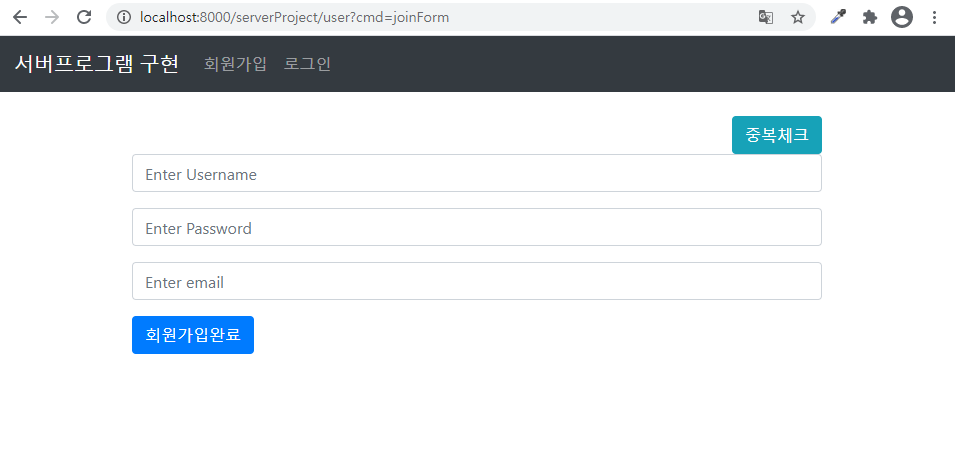
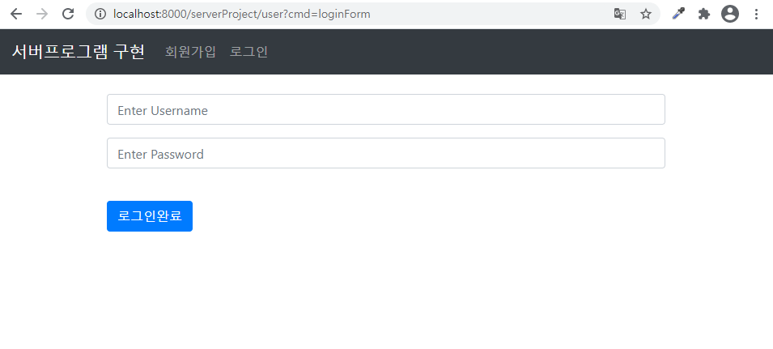
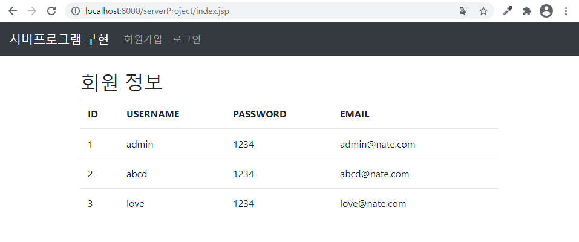
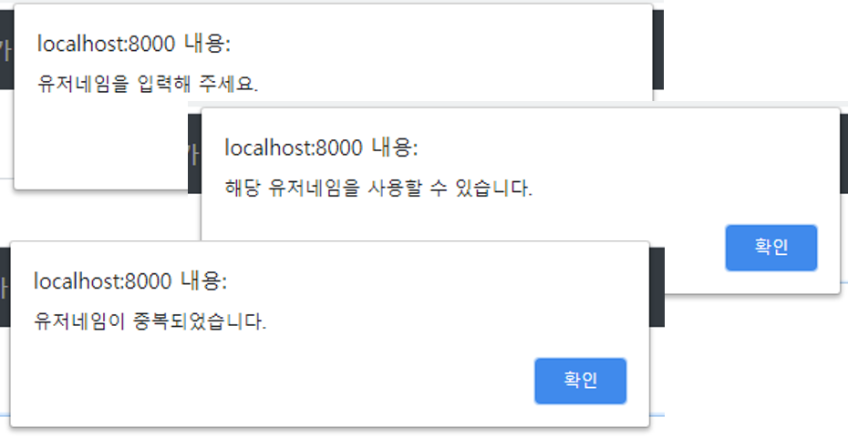
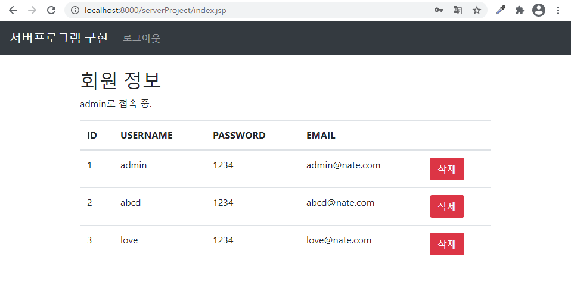
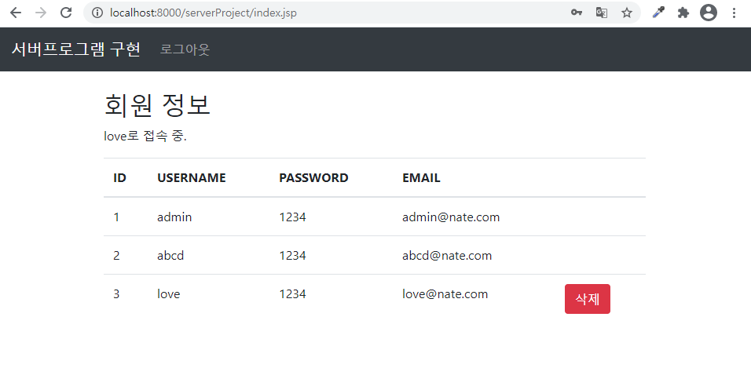
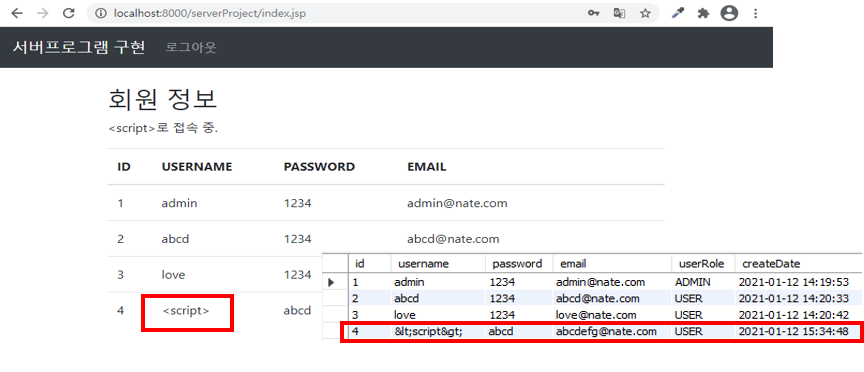

# JSP 서버 프로그램 구현 프로젝트

## 환경
- windows
- JDK1.8
- tomcat9.0
- sts tool
- mysql8.0
- postman
- lombok
- jstl
- gson(json 파싱)
- lucy-xss-filter
- git

## MySQL 데이터베이스 생성 및 사용자 생성
```sql
create user 'testuser'@'%' identified by 'bitc5600';
GRANT ALL privileges on *.* TO 'testuser'@'%';
create database serverProject;
```

## MySQL 테이블 생성
- testuser 사용자로 접속
- 데이터베이스 선택 use serverProject;

### User 테이블
```sql
create table user (
    id int primary key auto_increment,
    username varchar(100) not null unique,
    password varchar(100) not null,
    email varchar(100) not null,
    userRole varchar(20),
    createDate timestamp
)engine=InnoDB default charset=utf8;
```
## DB 연결
- context.xml 설정

```xml
<Resource name="jdbc/TestDB" auth="Container"
		type="javax.sql.DataSource" maxTotal="100" maxIdle="30"
		maxWaitMillis="10000" username="testuser" password="bitc5600"
		driverClassName="com.mysql.cj.jdbc.Driver"
		url="jdbc:mysql://localhost:3306/serverproject?serverTimezone=Asia/Seoul" />
```

- web.xml 설정

```xml
	<resource-ref>
		<description>DB Connection</description>
		<res-ref-name>jdbc/TestDB</res-ref-name>
		<res-type>javax.sql.DataSource</res-type>
		<res-auth>Container</res-auth>
	</resource-ref>
```

- DB.java

```java
package com.cos.serverproject.config;

import java.sql.Connection;
import java.sql.PreparedStatement;
import java.sql.ResultSet;

import javax.naming.Context;
import javax.naming.InitialContext;
import javax.sql.DataSource;

public class DB {
	public static Connection getConnection() {
		try {
			Context initContext = new InitialContext();
			Context envContext  = (Context)initContext.lookup("java:/comp/env");
			DataSource ds = (DataSource)envContext.lookup("jdbc/TestDB");
			Connection conn = ds.getConnection();
			return conn;
		} catch(Exception e) {
			System.out.println("DB 연결실패");
			e.printStackTrace();
		}
		
		return null;
	}
	
	public static void close(Connection conn, PreparedStatement pstmt) {
		try {
			conn.close();
			pstmt.close();
		} catch(Exception e) {
			e.printStackTrace();
		}
		
	}
	
	public static void close(Connection conn, PreparedStatement pstmt, ResultSet rs) {
		try {
			conn.close();
			pstmt.close();
			rs.close();
		} catch(Exception e) {
			e.printStackTrace();
		}
		
	}
}
```

## 디자인
- Bootstrap 4를 이용하여 디자인

### 회원가입
<p align="center">
  
</p>

### 로그인
<p align="center">
  
</p>

### 회원정보 리스트
<p align="center">
  
</p>

## 주요 기능
### 회원가입
#### 유저네임 중복 체크
<p align="center">
  
</p>

### 회원 삭제

- 관리자 로그인 : 모든 회원 삭제 가능

<p align="center">
  
</p>

- 일반 user 로그인 : 자신의 정보만 삭제 가능

<p align="center">
  
</p>

### 필터
#### 인코딩 필터

```java
package com.cos.serverproject.config;

import java.io.IOException;

import javax.servlet.Filter;
import javax.servlet.FilterChain;
import javax.servlet.ServletException;
import javax.servlet.ServletRequest;
import javax.servlet.ServletResponse;
import javax.servlet.http.HttpServletRequest;
import javax.servlet.http.HttpServletResponse;

public class CharConfig implements Filter{

	@Override
	public void doFilter(ServletRequest req, ServletResponse resp, FilterChain chain)
			throws IOException, ServletException {
		HttpServletRequest request = (HttpServletRequest) req;
		HttpServletResponse response = (HttpServletResponse) resp;
		
		request.setCharacterEncoding("utf-8");
		response.setContentType("text/html; charset=utf-8");
		
		
		chain.doFilter(request, response);
		
	}

}
```
- web.xml 설정

```xml
	<filter>
		<filter-name>charConfig</filter-name>
		<filter-class>com.cos.serverproject.config.CharConfig</filter-class>
	</filter>
	
	<filter-mapping>
		<filter-name>charConfig</filter-name>
		<url-pattern>/*</url-pattern>
	</filter-mapping>
```
#### URL 접근 금지 필터

```java
package com.cos.serverproject.config;

import java.io.IOException;
import java.io.PrintWriter;

import javax.servlet.Filter;
import javax.servlet.FilterChain;
import javax.servlet.ServletException;
import javax.servlet.ServletRequest;
import javax.servlet.ServletResponse;
import javax.servlet.http.HttpServletRequest;
import javax.servlet.http.HttpServletResponse;

public class ForbiddenUrlConfig implements Filter {

	@Override
	public void doFilter(ServletRequest req, ServletResponse resp, FilterChain chain)
			throws IOException, ServletException {
		HttpServletRequest request = (HttpServletRequest) req;
		HttpServletResponse response = (HttpServletResponse) resp;

		System.out.println("ForbiddenUrlConfig 접근");
		System.out.println(request.getRequestURI());
		System.out.println(request.getRequestURL());
		
		if(request.getRequestURI().equals("/serverProject/") || request.getRequestURI().equals("/serverProject/index.jsp")) {
			chain.doFilter(request, response);
		} else {
    		PrintWriter out = response.getWriter();
    		out.print("잘못된 접근입니다.");
    		out.flush();
    	}

	}

}
```
- web.xml 설정

```xml
	<filter>
		<filter-name>forbiddenUrlConfig</filter-name>
		<filter-class>com.cos.serverproject.config.ForbiddenUrlConfig</filter-class>
	</filter>
	
	<filter-mapping>
		<filter-name>forbiddenUrlConfig</filter-name>
		<url-pattern>*.jsp</url-pattern>
	</filter-mapping>
```
#### XSS 방어 필터
##### lucy-xss-servlet-filter 사용

<a>https://github.com/naver/lucy-xss-filter</a>

<p align="center">
  
</p>

- lucy-xss-servlet-filter-rule.xml

```xml
	<?xml version="1.0" encoding="UTF-8"?>
<config xmlns="http://www.navercorp.com/lucy-xss-servlet">
	<defenders>
		<!-- XssPreventer 등록 -->
		<defender>
			<name>xssPreventerDefender</name>
			<class>com.navercorp.lucy.security.xss.servletfilter.defender.XssPreventerDefender
			</class>
		</defender>
	</defenders>

	<!-- XssSaxFilter 등록 -->
	<defender>
		<name>xssSaxFilterDefender</name>
		<class>com.navercorp.lucy.security.xss.servletfilter.defender.XssSaxFilterDefender
		</class>
		<init-param>
			<param-value>lucy-xss-sax.xml</param-value>   <!-- lucy-xss-filter의 sax용 설정파일 -->
			<param-value>false</param-value>        <!-- 필터링된 코멘트를 남길지 여부, 성능 효율상 false 추천 -->
		</init-param>
	</defender>

	<!-- default defender 선언, 필터링 시 지정한 defender가 없으면 여기 정의된 default defender를 
		사용해 필터링 한다. -->
	<default>
		<defender>xssPreventerDefender</defender>
	</default>

	<!-- global 필터링 룰 선언 -->
	<global>
		<params>
			<param name="content" useDefender="false" />
		</params>
	</global>

	<url-rule-set>
		<url-rule>
			<url>/*</url>
			<params>
				<param name="content">
					<defender>xssSaxFilterDefender</defender>
				</param>
			</params>
		</url-rule>
	</url-rule-set>
</config>
```

- lucy-xss-sax.xml

``` xml
<?xml version="1.0" encoding="UTF-8"?>

<config xmlns="http://www.nhncorp.com/lucy-xss"
	extends="lucy-xss-default-sax.xml">

	<elementRule>
        <element name="p"/>
        <element name="a" />
        <element name="abbr"/>
        <element name="acronym"/>
        <element name="adress"/>
        <element name="applet"/>
        <element name="area"/>
        <element name="b"/>
        <element name="base"/>
        <element name="basefont"/>
        <element name="bdo"/>
        <element name="big"/>
        <element name="blockquote"/>
        <element name="body"/>
        <element name="br"/>
        <element name="button"/>
        <element name="caption"/>
        <element name="center"/>
        <element name="cite"/>
        <element name="code"/>
        <element name="col"/>
        <element name="colgroup"/>
        <element name="dd"/>
        <element name="del"/>
        <element name="dfn"/>
        <element name="dir"/>
        <element name="div"/>
        <element name="dl"/>
        <element name="dt"/>
        <element name="em"/>
        <element name="embed"/>
        <element name="fieldset"/>
        <element name="font"/>
        <element name="form"/>
        <element name="frame"/>
        <element name="frameset"/>
        <element name="h1"/>
        <element name="h2"/>
        <element name="h3"/>
        <element name="h4"/>
        <element name="h5"/>
        <element name="h6"/>
        <element name="head"/>
        <element name="hr"/>
        <element name="html"/>
        <element name="i"/>
        <element name="iframe"/>
        <element name="img"/>
        <element name="input"/>
        <element name="ins"/>
        <element name="isindex"/>
        <element name="kbd"/>
        <element name="label"/>
        <element name="legend"/>
        <element name="li"/>
        <element name="link"/>
        <element name="map"/>
        <element name="marquee"/>
        <element name="menu"/>
        <element name="meta"/>
        <element name="nobr"/>
        <element name="noframes"/>
        <element name="noscript"/>
        <element name="object"/>
        <element name="ol"/>
        <element name="optgroup"/>
        <element name="option"/>
        <element name="p"/>
        <element name="param"/>
        <element name="pre"/>
        <element name="q"/>
        <element name="rt"/>
        <element name="ruby"/>
        <element name="s"/>
        <element name="samp"/>
        <!-- <element name="script"/> -->
        <element name="select"/>
        <element name="small"/>
        <element name="span"/>
        <element name="strike"/>
        <element name="strong"/>
        <element name="style"/>
        <element name="sub"/>
        <element name="sup"/>
        <element name="table"/>
        <element name="tbody"/>
        <element name="td"/>
        <element name="textarea"/>
        <element name="tfoot"/>
        <element name="th"/>
        <element name="thead"/>
        <element name="title"/>
        <element name="tr"/>
        <element name="tt"/>
        <element name="u"/>
        <element name="ul"/>
        <element name="var"/>
        <element name="wbr"/>
        <element name="xml"/>
        <element name="xmp"/>
        
        <!-- HTML5 added at 2012.04.10 Start-->
        <element name="article"/>
        <element name="aside"/>
        <element name="audio"/>
        <element name="bdi"/>
        <element name="canvas"/>
        <element name="command"/>
        <element name="datalist"/>
        <element name="details"/>
        <element name="figcaption"/>
        <element name="figure"/>
        <element name="footer"/>
        <element name="header"/>
        <element name="hgroup"/>
        <element name="keygen"/>
        <element name="mark"/>
        <element name="meter"/>
        <element name="nav"/>
        <element name="output"/>
        <element name="progress"/>
        <element name="rp"/>
        <element name="section"/>
        <element name="source"/>
        <element name="summary"/>
        <element name="time"/>
        <element name="track"/>
        <element name="video"/>
        <!-- HTML5 added at 2012.04.10 End-->
        
        <!-- IE핵 처리를 위해 추가-->
        <element name="IEHackExtension" disable="ture" >
        </element>
    </elementRule>
 
    <attributeRule>
        <attribute name="src">
            <allowedPattern><![CDATA[['"]?\s*http://.*]]></allowedPattern>
        </attribute>
        <attribute name="href">
            <notAllowedPattern><![CDATA[(?i:script)]]></notAllowedPattern>
            <notAllowedPattern><![CDATA[(?i:\.css)]]></notAllowedPattern>
        </attribute>
        <attribute name="style" disable="false" exceptionTagList="a"/>
    </attributeRule>


</config>
```
- web.xml 설정

``` xml
	<filter>
		<filter-name>xssEscapeServletFilter</filter-name>
		<filter-class>com.navercorp.lucy.security.xss.servletfilter.XssEscapeServletFilter</filter-class>
	</filter>
	
	<filter-mapping>
		<filter-name>xssEscapeServletFilter</filter-name>
		<url-pattern>/*</url-pattern>
	</filter-mapping>
```
